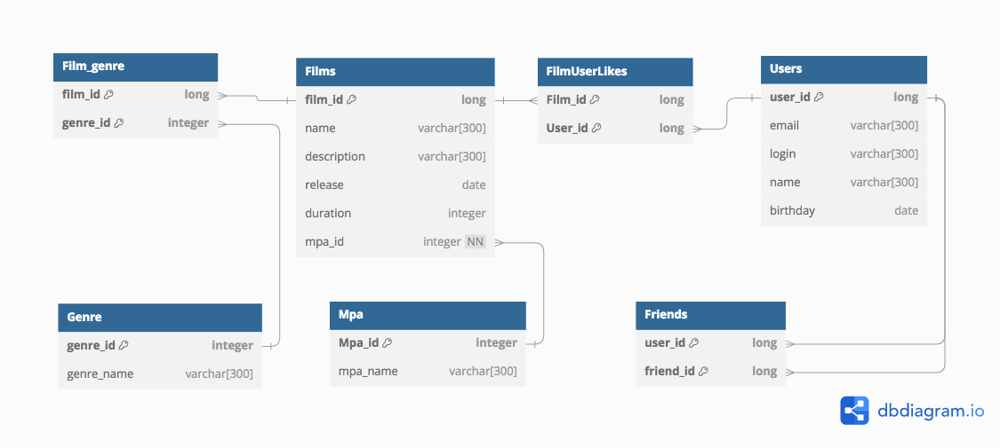

# java-filmorate
Template repository for Filmorate project.
Репозиторий шаблонов для проекта Filmorate.

БД состоит из нескольких таблиц, связанных между собой:

1. хранения пользователей (users) 
2. хранения фильмов (films) 
3. друзей (user_friends) 
4. лайков к к фильмам (film_liked) 
5. хранения статусов пользователя (status) 
6. хранения жанров (genre) 

Запросы в БД:

Получить все фильмы: SELECT * FROM films;
Получить фильм по id: SELECT * FROM films WHERE film_id = id;
Получить определенное количество фильмов n: SELECT * FROM films LIMIT n
Получить всех пользователей: SELECT * FROM users;
Получить пользователя по id: SELECT * FROM users WHERE user_id = id;
Получить друзей определенного user-а по id: SELECT * FROM user_friends WHERE user_id = id
Получить общих друзей пользователя user1 (id1) с user2 по id (id2): SELECT uf.user_id, u.login FROM user_friends AS uf INNER JOIN users AS u ON u.user_id = uf.user_id WHERE (uf.user_id) = id1 AND (uf.user_id) = id2 AND COUNT (user_id) > 1 GROUP BY uf.user_id

